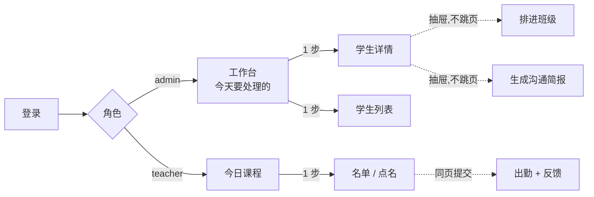

# DESIGN.md — student-lifecycle

> 教育机构学生生命周期管理系统。覆盖从咨询试听到排课上课续费的完整业务链路。

---

## 1. 业务链路与切片选择

### 学生生命周期状态机

```
INQUIRY ──> TRIAL_SCHEDULED ──> TRIAL_ATTENDED ──> ENROLLED ──> AT_RISK ──> CHURNED
   │                                   │                │           │
   └──> LOST（没约上）                  └──> LOST         └───────────┘（续费回到 ENROLLED）
```

### 实现范围：[2] 排试听 → [8] admin 工作台

完整链路共 9 步。切片从第 [2] 步（排试听）实现到第 [8] 步（admin 工作台处理），第 [1] 步（录入咨询）提供极简表单，第 [9] 步（续费/流失）仅做状态标记。

**切片选择逻辑**：评分要求同时满足两个条件——规则够硬（能顶住绕过界面的破坏测试）且不砍掉业务起点（背景明确说"从咨询试听开始"）。规则最硬的方案（纯排课/纯点名）不是业务起点；最贴业务起点的方案（咨询→试听→跟进）规则最软。

**破局点**：试听与正式课在时空调度层是同一个东西——都是"某老师、某时段、一节课、有学生出席"。用 `ClassSession(type=TRIAL|REGULAR)` 统一建模，差别只在计费层（试听不扣课时）和状态机层（试听后必须标结果）。这让排课引擎、冲突检测、点名流程全部复用，两个条件同时满足。

---

## 2. 数据模型

### 四个关键洞见

1. **Guardian ≠ Student**：咨询的是家长、上课的是孩子、付款人可能是第三方 → `Guardian` + `StudentGuardian(isPrimaryContact, isPayer)`
2. **ClassGroup ≠ ClassSession**：前者是每周固定的周期规则，后者是某天某节具体的课。出勤、调课、代课、请假全发生在 session 上——没有 session 实体，"老师请假一周"无解
3. **课时是钱**：`CreditLedger` 是真相（流水），`CreditAccount.balance` 是同事务内维护的物化值，物化的唯一目的是挂 `CHECK (balance >= 0)` 让数据库兜住负余额
4. **试听是特例也是同类**：占老师时段、要查冲突，但不扣课时、每学生仅一次 → `type` 区分，不建独立模型

### Prisma 实体（精简）

```
User             id, email@unique, passwordHash, role(ADMIN|TEACHER), name, teacherId?
Teacher          id, name, subjects[], active
Guardian         id, name, phone, email?, wechat?
Student          id, name, grade?, status(见状态机), ownerAdminId→User, source?
StudentGuardian  studentId, guardianId, relation, isPrimaryContact, isPayer
Course           id, name, subject, level
ClassGroup       id, courseId, teacherId, weekday(0-6), startTimeLocal("16:00"),
                 durationMin, capacity, startDate, timezone="Australia/Melbourne"
Enrollment       id, studentId, classGroupId, status(ACTIVE|PAUSED|LEFT), startDate
ClassSession     id, classGroupId?, teacherId, type(REGULAR|TRIAL|MAKEUP),
                 startsAt(timestamptz), endsAt, status(SCHEDULED|COMPLETED|CANCELLED)
SessionParticipant  sessionId, studentId, source(ENROLLMENT|TRIAL|MAKEUP)  @@unique
Attendance       id, sessionId, studentId, status(PRESENT|LATE|ABSENT|EXCUSED),
                 teacherNote?, recordedById                                 @@unique([sessionId,studentId])
CreditAccount    id, studentId@unique, balance Int, lowBalanceThreshold Int @default(4)
CreditLedger     id, studentId, delta Int, reason(PURCHASE|CONSUME|REFUND|EXPIRE|ADJUST),
                 sessionId?, idempotencyKey@unique
CreditPurchase   id, studentId, credits Int, amountCents Int, purchasedAt
FollowUpTask     id, studentId, ownerAdminId, type(TRIAL_FOLLOWUP|LOW_BALANCE|ABSENCE_RISK),
                 status(OPEN|DONE|DISMISSED), dueAt, sourceSessionId?
LessonDigest     id, studentId, inputHash@unique, payload Json, model, createdAt
```

金额用 `amountCents Int`，课时用 `Int`——不用浮点。

### 手写 SQL 约束（Prisma 表达不了的）

```sql
-- 余额不可为负（破坏测试的第一道墙）
ALTER TABLE "CreditAccount" ADD CONSTRAINT balance_non_negative CHECK (balance >= 0);

-- 一个学生只能试听一次
CREATE UNIQUE INDEX one_trial_per_student ON "SessionParticipant"(student_id)
  WHERE source = 'TRIAL';

-- 同类跟进任务不重复开
CREATE UNIQUE INDEX one_open_task_per_type ON "FollowUpTask"(student_id, type)
  WHERE status = 'OPEN';

-- 老师时段冲突交给数据库（ClassSession 自带 teacher_id + 时间区间，零成本）
CREATE EXTENSION IF NOT EXISTS btree_gist;
ALTER TABLE "ClassSession" ADD CONSTRAINT teacher_no_overlap
  EXCLUDE USING gist (teacher_id WITH =, tstzrange(starts_at, ends_at) WITH &&)
  WHERE (status <> 'CANCELLED');
```

**学生时段冲突为何用应用层**：`SessionParticipant` 没有时间列，要上 exclusion constraint 需把 `startsAt/endsAt` 冗余过去并在改课时同步维护。10 小时预算内选择在事务内 `SELECT ... FOR UPDATE` 锁 `Student` 行后做应用层检查。这是显式的取舍，不是遗漏。

---

## 3. 业务规则

| # | 规则 | 执行层 | 破坏测试期待 |
|---|---|---|---|
| 1 | 老师同一时段不能带两节课 | DB exclusion constraint | DB 直接报错 |
| 2 | 学生同一时段不能上两节课（含试听） | 应用层，事务内 `SELECT FOR UPDATE` 锁 Student 行 | 409 Conflict |
| 3 | 课时余额不可为负 | DB CHECK + 事务内行锁 | 事务回滚 |
| 4 | 点名幂等：同一课次同一学生只扣一次 | `Attendance` 唯一约束 + `CreditLedger.idempotencyKey` 唯一 | 重复请求返回既有结果，不重复扣 |
| 5 | 一个学生只能试听一次 | DB partial unique index | DB 直接报错 |
| 6 | 试听不扣课时 | 应用层（`type=TRIAL` 不产生 ledger） | 断言 ledger 无新增 |
| 7 | admin 只能改自己名下学生 | NestJS `OwnershipGuard`（写操作校验 `ownerAdminId`） | 403 Forbidden |
| 8 | 班级容量不可超 | 应用层，事务内 count 校验 | 409 Conflict |
| 9 | 出勤提交后不可修改；订正只能 admin 走冲正（留痕） | 应用层状态机 + role 校验 | 422 / 403 |

**锁的关键细节**：规则 2 和 3 锁的是 **`Student` 行**，不是 session 或 classGroup——冲突和余额都是该学生的属性。锁错目标，两个并发事务各自查到"无冲突"后同时插入，幻读。

---

## 4. 页面与信息结构

### 导航结构



路由共 6 个：`/login`、`/`（admin 工作台）、`/students`、`/students/$id`、`/teacher/today`、`/sessions/$id`。

### 高频操作步数

| 操作 | 角色 | 步数 |
|---|---|---|
| 给今天的课点名 | teacher | 2（登录 → 今日课程（首页）→ 点名提交） |
| 处理一条待跟进 | admin | 2（登录 → 工作台（首页）→ 标记） |
| 打续费电话前看简报 | admin | 2（工作台 → [联系] → [生成简报]） |
| 把学生排进班 | admin | 2（学生详情 → [排进班级]抽屉 → 确认） |

高频操作全部 ≤2 步，且不离开当前页面（用抽屉与内联展开，不跳转）。

### 页面草图

**1. Admin 工作台 `/`**

```
┌ ADMIN 工作台   /                                  王顾问 ▾
│
├─ 今天要处理的 · 12
│   ┌ 试听待跟进 · 3 ───────────────────── 逾期排最前
│   │  张小明   9/15 试听 · IELTS写作   ⚠ 逾期1天   [跟进]
│   │  李大伟   9/16 试听 · 口语初级                [跟进]
│   ├ 课时将尽 · 7 ────────────────────── 剩 ≤4 课时
│   │  李小红   剩 3 课时 · 下次课 周四16:00        [联系]
│   │  赵明     剩 2 课时 · 下次课 周三18:00        [联系]
│   └ 连续缺勤 · 2 ─────────────────────────────────
│      陈子豪   连续缺 2 次 · 周二18:00 班          [联系]
│
├─ 我的概览
│   我的学生 87      本周排课 14      待确认试听 2
│
└─ [+ 新建咨询]   [学生列表]
```

首页不是学生表格，是"今天我要处理谁"。87 个学生藏在二级页面，因为 admin 早上的问题不是"我有哪些学生"，而是"谁快掉队了"。

**2. 学生详情 `/students/$id`**

```
┌ ← 工作台    李小红 · 12岁                   ENROLLED  ▾操作
│
├─ 联系人
│   李太太（母亲 · 主联系人 · 付款人）13x-xxxx-xxxx
│
├─ 课时                                       剩余 3  ⚠低于阈值
│   9/01  购买 20 课时  ¥4,800      王顾问
│   9/04  上课扣减 −1   IELTS写作   系统
│   9/11  缺勤扣减 −1   IELTS写作   系统
│   ...                                            [购买课时]
│
├─ 在读班级
│   IELTS写作初级 · 周四16:00 · 李老师 · 9/04起  ACTIVE
│                                                  [排进班级]
│
├─ 最近出勤与反馈                                       8 条 ▾
│   10/23 ●在  "这次作文6.5，进步明显"   李老师
│   10/09 ◐迟  "迟到20分钟，后半节跟上了"  李老师
│
├─ 跟进
│   ⚠ 课时将尽 · 系统 9/16 创建
│      [生成沟通简报]  ← LLM，点了才调
│      [已联系]  [已续费]  [暂不续费]
└─
```

课时区展示的是**流水**不是一个数字——课时是钱，admin 要能回答家长"我这 20 节课怎么用掉的"。

**3. 老师今日课程 `/teacher/today`**

```
┌ 今日课程   周四 9/16   墨尔本时间                 李老师 ▾
│
│   16:00–17:30   IELTS写作初级 · A教室
│   6 人 · 其中 1 位首次上课                        [点名]
│
│   18:00–19:30   IELTS口语中级 · B教室
│   4 人                                        ✓ 已点名
└─
```

**4. 点名页 `/sessions/$id`**

```
┌ ← 返回    IELTS写作初级 · 今天 16:00 · A教室
│
│  学生            出勤                    课堂反馈
│  ─────────────────────────────────────────────────
│  张小明 🆕首次    ○在 ○迟 ○缺 ○请假   [            ]
│  李小红 ⚠课时将尽 ●在 ○迟 ○缺 ○请假   [结构有进步… ]
│  王芳   🎧试听生  ●在 ○迟 ○缺 ○请假   [            ]
│  陈子豪           ○在 ○迟 ●缺 ○请假   [            ]
│
│  ⓘ 提交后将扣除到课学生各 1 课时（试听生不扣），提交后不可修改
└─ [提交点名]
```

三个标签解决背景痛点："老师不知道今天班里谁是新来的"。老师只看到"课时将尽"的布尔标记，看不到具体金额——课时是钱，老师需要的是"提醒联系顾问"这个信号，不是账务明细。

**5. 排课抽屉（从学生详情弹出）**

```
  ┌ 排进班级                                          ✕
  │
  │  学生  李小红        剩余课时 3
  │
  │  选择班级
  │  ● IELTS写作初级  周四16:00 李老师  5/8人  ✓ 可排
  │  ○ 口语中级        周四16:30 陈老师  4/8人  ✗ 与"IELTS写作初级"时间冲突
  │  ○ 语法强化        周二18:00 王老师  8/8人  ✗ 已满员
  │  ○ 阅读提升        周一17:00 李老师  3/8人  ⚠ 可排，但剩余课时仅够 3 周
  │
  │  起始日期  2026-09-17
  └  [取消]  [确认排课]
```

三种拦截理由（冲突 / 满员 / 余额不足）**区分表达且说明原因**，不是统一灰掉按钮。这些校验在服务端也会完整跑一遍——前端说人话，服务端做把关。

---

## 5. LLM 使用

**用了哪里**：admin 工作台 → 学生详情 → `[生成沟通简报]`。把近 8 次出勤与教师反馈聚合成 admin 打续费电话前的简报（进度归纳、强项、隐忧、风险等级、家长话术草稿）。

真正省人力的不是结构化一两句反馈，而是帮 admin 省去翻两个月出勤记录的时间。且这是**只读聚合**，降级路径天然干净。

**输出 schema（zod 校验）**：

```ts
{
  progress_summary: string,   // ≤80 字
  strengths: string[],        // 1-3 条
  concerns: string[],         // 0-3 条
  risk_level: 'low'|'medium'|'high',
  parent_message_draft: string, // ≤120 字
  talking_points: string[]    // 2-4 条
}
```

**硬约束**：模型不输出任何数字事实——剩余课时、出勤率、金额全由数据库渲染，模型只做定性归纳。（不让 LLM 碰钱。）

**四层 injection 防御**：①用户内容放在明确分隔区并声明为数据而非指令 ②structured output schema 强约束输出形状 ③枚举白名单 + 长度截断 ④输出侧内容检查（命中则整份降级）。最关键的安全边界：**LLM 输出不参与任何写操作**——最坏情况是 admin 看到一段被污染的建议文案，旁边永远并列原始反馈供核对。

**降级**：超时 / schema 校验失败 / provider 报错 → 返回 `{ available: false }`，前端展示原始反馈时间线 + 出勤统计表。续费流程与任务流转完全不依赖它。

**成本控制**：结果按 `inputHash` 存 `LessonDigest`；只在 admin 主动点击时调用，不在页面加载时自动跑。

### 故意不用 LLM 的地方

| 场景 | 原因 |
|---|---|
| **排课推荐** | 确定性约束查询：科目匹配 + 时段不冲突 + 未满员。SQL 更准、更快、可解释。用 LLM 是反模式 |
| **自然语言查询** | 好的信息架构让它变得多余——工作台已经把待处理项直接推到 admin 眼前。需要自然语言查询，往往说明 UI 没设计好 |

---

## 6. 架构决策

| 决策 | 理由 |
|---|---|
| **纯 SPA，不用 SSR 框架** | 业务规则必须在 NestJS 才能被绕过界面测试。SSR 框架自带服务端，每个接口要写 controller + 转发层两遍，还要额外解释"为什么有两个服务端"。这是个登录后才用的内部后台，没有 SEO 和首屏需求 |
| **NestJS 单服务托管 SPA 产物** | 同域 → 零 CORS、httpOnly cookie 天然 first-party、评审点开一个链接就能用。dev/prod 都同域，不会"本地能跑线上挂" |
| **ClassGroup / ClassSession 分离** | 出勤、调课、代课、请假都发生在具体课次上。没有 session 实体，"老师临时请假一周"无解 |
| **CreditLedger 流水 + CreditAccount 物化余额** | 课时是钱必须可审计；物化余额是为了能挂 `CHECK (balance >= 0)` 让数据库兜住负余额，不是为了查询性能 |
| **Neon 而非 Supabase** | Supabase 免费项目 7 天无活动会 pause 整个项目（数据库不可访问，需手动恢复）。Neon 只休眠 compute，冷启动 300–800ms，数据库始终可达；branch 功能便于重置演示数据 |

---

## 7. 假设与已知限制

**明确假设**

1. 家长不登录系统，仅作数据实体（联系人和付款人）
2. 课时全局池、不过期——单一 balance 无法表达"过期该扣哪个包"，第一版保持模型自洽，过期是第二版
3. 课时跨科目通用（一个 CreditAccount 对应一个学生）
4. 缺勤照扣课时（不到课也占用了老师时间）
5. 业务时间统一 `Australia/Melbourne`（有夏令时，ClassGroup 存本地墙钟时间，生成 session 时再转 UTC）
6. Admin 可读全部学生，但只能改自己名下的（`ownerAdminId` 隔离写操作）
7. 通知发送（邮件/微信）是集成问题，第一版只做站内跟进任务
8. 家长不登录系统
9. 课次生成覆盖相对今天的过去 4 周 + 未来 2 周

**已知限制**

- 课次生成覆盖未来两周，无滚动补齐（生成窗口到期后需重新触发）
- 学生时段冲突用应用层行锁而非 DB exclusion constraint（原因见规则 #2）
- 公共假期不处理
- Render 免费档冷启动约 30–60 秒；Neon 免费档 compute 休眠后第一次连接约 0.3–0.8 秒
